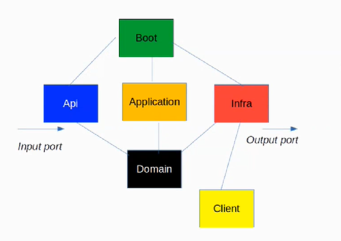

# Calculator
Este repositorio contiene una aplicación Spring Boot 3.0.6 en la cual se implementa una calculadora, cuyo ejercicio puede encontrarse en la carpeta [docs](docs/exercise.md)

Para la implementación se escogió arquitectura hexagonal debido a la separación de la lógica de negocio del resto de lógica, capas de persistencia, clientes REST,...

A mayores se intenta seguir los patrones CQRS y DDD. 

El proyecto está dividido en los siguientes módulos:
- **api:** implementa los puertos de entrada, en este caso servicios REST
- **application:** implementación de los casos de uso (donde está la lógica de negocio)
- **boot:** módulo principal (también contiene los tests de integración)
- **domain:** core de la aplicación. Definición de qué es lo que hace la aplicación, pero sin decir cómo
- **infrastructure:** puertos de salida



Las principales tecnologías utilizadas son:
- **Java 17**
- **OpenApi** definición y generación de API
- **Mapstruct** mapear objetos entre ellos
- **Lombok** generación automática de código

## Instalación y ejecución

Para poder lanzar la aplicación necesitaremos tener Java y Maven instalados (versiones compatibles con Java 17). En mi caso personal he utilizado IntelliJ para el desarrollo.

Para compilar realizaremos un clean install normal con Maven:
```bash
  mvn clean install
```
Después de eso podemos lanzarlo con el siguiente comando: 
```bash
  mvn spring-boot:run
```

No es necesario ningún tipo de autenticación para lanzar peticiones al servicio.

## Uso

Para hacer cualquier llamada podríamos usar esta URL como ejemplo:

```
GET http://localhost:8080/calculator/v1/sum?operator1=12&operator2=1
GET http://localhost:8080/calculator/v1/substraction?operator1=12&operator2=1
```

Se podría incluír Swagger para poder tener una forma más fácil de realizar requests.

# Additional comments

Teniendo en cuenta las exigencias de escalabilidad, sobre todo indicando que en el futuro se realizarán operaciones más
complejas, se divide en varios endpoints, uno por cada operación. De esta forma nos aseguramos la independencia 
entre ellos y la flexibilidad a la hora de modificar cualquier endpoint sin afectar al resto de operaciones (por ejemplo
en el caso de que una de las próximas operaciones necesite más de un parámetro o que tengan unas condiciones exclusivas). 

Si fuesen endpoints cerrados a modificaciones futuras se podría haber implementado en un solo endpoint, incluyendo 
un nuevo parámetro que sea un elemento de un enumerado de las operaciones disponibles y en funcion de eso realizar uno 
u otro cálculo.

Por otra parte, resaltar que gracias al versionado de API evitaremos realizar cambios y desplegar versiones que rompan 
el funcionamiento de los actuales consumidores del servicio.

A mayores en el caso de que el rendimiento sea crítico, se podría implementar una caché para evitar realizar la misma 
operación repetitivamente.
